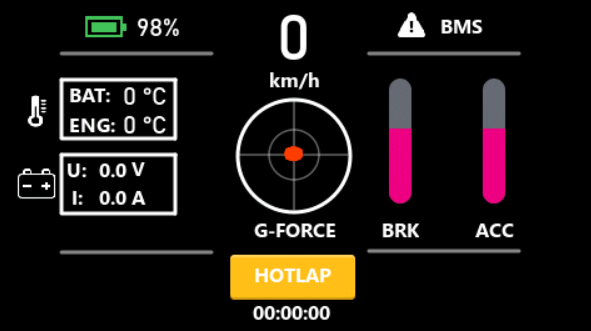
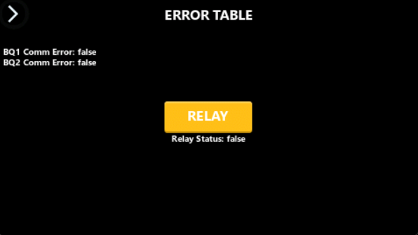
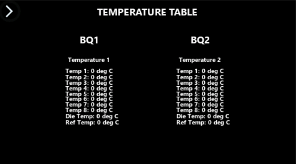
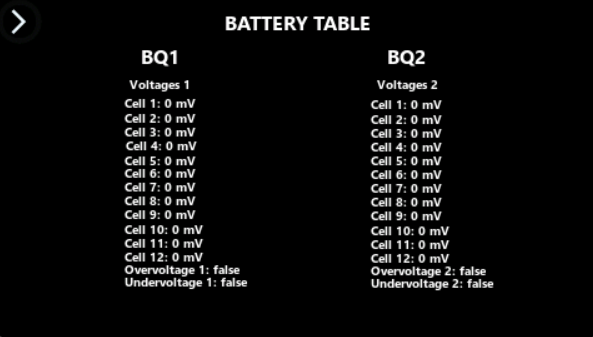

# 🚘 STM32 Go-Kart Dashboard  

> [!IMPORTANT]  
> **Work in Progress** — Development ongoing as of **22.10.2025**  
> This repository is part of my **Engineering Thesis Project** for the completion of my undergraduate studies.  
> 🎥 *We are also starting a YouTube channel documenting the Go-Kart assembly!*

## Overview  

This project constitutes the practical component of my **engineering thesis**, focusing on the design and implementation of a **real-time dashboard system** for an electric go-kart.  

The system is developed on the **STM32F746G-DISCO microcontroller** with a touchscreen display using **TouchGFX**, and is intended to collect, process, and visualize telemetry data from multiple hardware sensors.  

The dashboard serves as a **human–machine interface (HMI)**, enabling the driver to monitor essential parameters of the vehicle in real time. These include, but are not limited to:  

## Preview

<table align="center">
  <tr>
    <td align="center"> <b>Main Screen</b></td>
    <td align="center"> <b>Error Table</b></td>
  </tr>
  <tr>
    <td align="center"> <b>Temperature Table</b></td>
    <td align="center"> <b>Battery Table</b></td>
  </tr>
</table>

## Monitored Metrics  

| ***Metric***                | ***Description***                                |
|------------------------|--------------------------------------------|
| **Vehicle Speed**          | Real-time speed display.                   |
| **Throttle / Brake**       | Input level visualization.                  |
| **Battery**                | Voltage and temperature monitoring.         |
| **Motor Temperature**      | Prevents overheating and ensures reliability. |
| **Motor Driver Status**    | Health and fault monitoring.                |
| **G-Forces**               | Lateral and vertical forces in real time.   |
| **BMS Data (External)**    | Additional telemetry provided by an external Battery Management System (BMS), developed as a separate thesis project. This work only focuses on visualization of the received data. |
| **HOTLAP Button**           | Initiates a lap timer (stopwatch) in the dashboard, showing minutes, seconds, and centiseconds. Useful for tracking lap times during testing or racing sessions. |
| **Future Extensions**      | Additional sensor integrations planned.     |

The objective of this work is to provide a **robust, responsive, and intuitive interface** that supports safe and efficient operation of the electric go-kart.  

## Development Notes  

The project was initially developed without version control, with the focus placed on prototyping and interface design. 

As the implementation approaches the stage of **hardware integration**, this repository has been introduced to serve as a platform for:  

- Source code management and tracking.  
- Documentation of development progress. 
- Collaboration and versioning.  

## Roadmap  

| ***Status***    | ***Task*** |
|-----------|------|
| ✅ **Done**   | Acquisition of the go-kart frame. |
| ✅ **Done**   | Development of the UI prototype. |
| 🔄 **Ongoing** | Live sensor data implementation. |
| 🔄 **Ongoing** | Development of an export data feature. |
| 🔜 **Planned** | Implementation of battery management visualization. |
| 🔜 **Planned** | Integration of BLDC motor control. |
